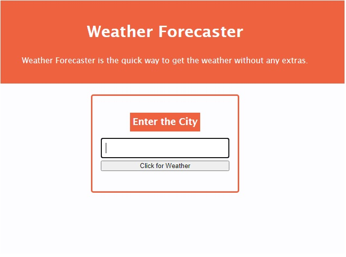

# Weather Forecaster

​
**Quick Look**


## Description
​
Website for **Weather Forecaster** to give you a quick search of weather for the city.
​
## What it consists of
You are able to enter the city you wish. It will display a 5 day weather report. 

### Needs Work
Cannot display all the info im getting back from the api. Only the tempature at the moment
​
### Dependencies
​* Windows 10
* HTML
* CSS
* Bootstrap
* Momentjs
* Jquery

### Compatibility
* Chrome
* Firefox
* MS Edge
​
### Work with Us
​
* Git Clone if you wish to collaborate 
```
git clone https://github.com/AdamR-Work/weather-board.git
```
​
### Site location
​
* https://adamr-work.github.io/weather-board/


​
## Help
​
If you have any questions or concerns contact me at adamrfiles@gmail.com
​
## Authors

* AdamR-Work
​

## Version History
​
*
* 0.1
    * Initial Version
    * See [Commits history](https://github.com/AdamR-Work/weather-board/commits/main)
​
## License
​
This project is licensed under the AdamR-Work License 
​
